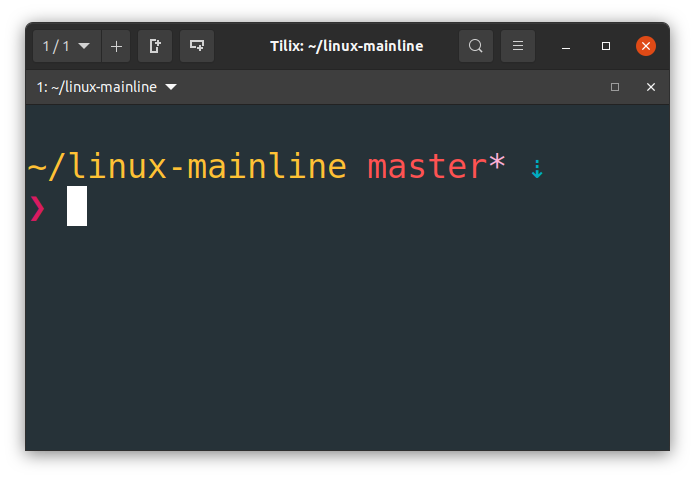
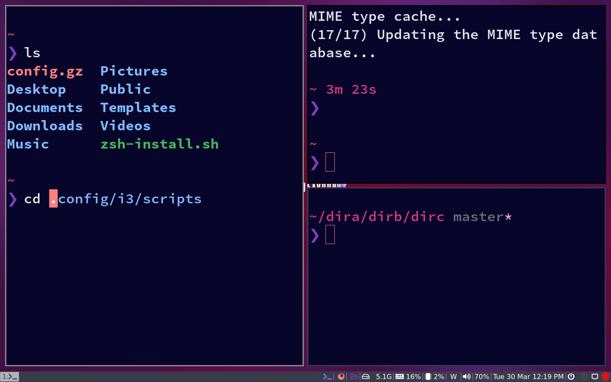

# Minimal Zsh and Oh-My-Zsh installation script

This script simply installs Zsh and Oh-My-Zsh, along with Pure theme and zsh-autosuggestions plugins. I made this script to quickly install and start using Zsh in any new OS/VM that I install.

This script should work in any operating system having one of these package managers: `dnf`, `pacman`, `apt`.

### Preview

### Usage
1. Just run `./min-zsh-install.sh` in your bash shell. The script should install zsh and also make it your default shell. Note that for some distribution, you will need to reboot for the shell change to take effect (usually in Fedora and Arch based distros).

### Note
The script requires `git` to download and install `Oh-My-Zsh` and `zsh-autosuggestions`.
